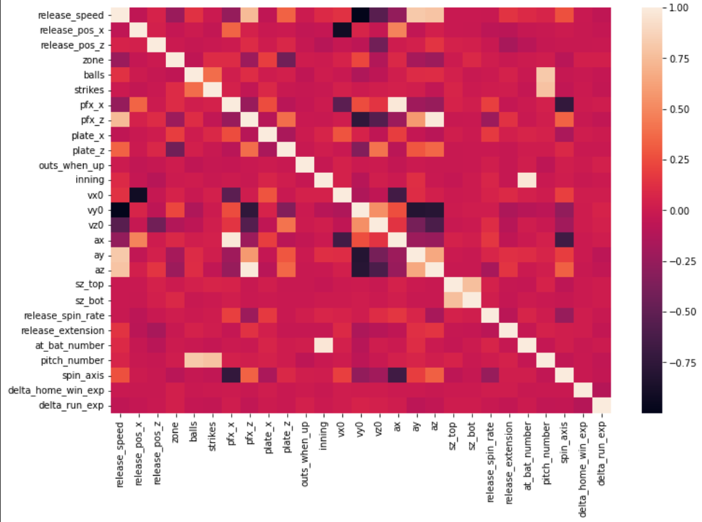

# Final-Project-Data-410
Final Research Project in DATA 410

## Introduction 
One aspect of data science that interests me a lot is its cross over between sports. One of the fields I would really like to go into as a career is using data to model and predict to help professional baseball teams optimize their results. For this reason, I have elected to do my final research using Data from Major League Baseball (MLB). In 2015 the MLB introduced _Statcast_. 

Description of Statcast"
"Statcast is a state-of-the-art tracking technology, capable of measuring previously unquantifiable aspects of the game. Set up in all 30 Major League ballparks, Statcast collects data using a series of high-resolution optical cameras along with radar equipment. The technology precisely tracks the location and movements of the ball and every player on the field, resulting in an unparalleled amount of information covering everything from the pitcher to the batter to baserunners and defensive players"

This allows for highly accurate data in all aspects of the sport. The dataset I have selected is Pitch data from 2021. I plan on using the information provided in the dataset to see how accuratly I can predict the outcome of a given pitch (hit, strike, ball, etc.).

## Data
The data set I have selected comes from Kaggle and is titled Statcast_2021. The raw data set has 93 different variables with a little over 70,000 observations. This represents every pitch thrown over the course of the season. I aim to use the model to predict the target variable "pitch_name" which is the type of pitch the pitcher threw. There are 8 types of pitches that a pitcher can throw in this dataset: Splitter, Slider, Sinker, Knuckle Curveball, Cutter, Curveball, Changeup, and Fastball.

For the independent variables, some data can be eliminated immediately. There are many columns that have a majority of their values missing, so removing those columns from the data set would be beneficial. Additionally there are variables included that clearly  have no impact on the result of the ptich such as the date. There are also variables that are somewhat repetitive, for each pitcher and batter, it gives the name and the ID number so removing the names of the players would help narrow down the independent variables. 

Although there are many variables in the data set there are ones that I belive will be better predictors. This list includes: Pitch Type (Fastball, curveball etc.), pitch velocity, pitch angle, zone, release point, runners on base, spin direction, spin rate, and more. 

There are also some variables in the data set that I cannot tell what they mean. 

## Methods
### Preparing the data
Before getting into coding for the project, all the necessary packages must be imported
```Python
import pandas as pd
import seaborn as sns
import numpy as np
import matplotlib.pyplot as plt
from sklearn.ensemble import RandomForestClassifier as rf
from sklearn import tree
from sklearn.model_selection import KFold, train_test_split as tts
from sklearn.preprocessing import StandardScaler
from sklearn.ensemble import RandomForestClassifier as rf, GradientBoostingClassifier as gbc
from sklearn.metrics import classification_report
from imblearn.over_sampling import SMOTE
```
This dataset had over 75,000 observation to work with which is very large so a random sample of 1000 was taken to make the runtimes shorter and the data in general easier to work with 
```Python
statcast_initial = pd.read_csv("Statcast_2021.csv")
statcast = statcast_initial.sample(n=1000)
```
Even after roving data certain variables before loading the data into python, there still may be some independant variables that are correlated with eachother in the dataframe. This is refered to as multicolinearity. In order to prevent this a heatmap is created to determine which variables are correlated and must be removed. 
```Python
fig_dims = (12,8)
fig, ax = plt.subplots(figsize = fig_dims)
sns.heatmap(statcast.corr(), ax=ax)
```


It is evident that there is multicolinearity within the dataset so independant variables are removed: vy0, vx0, vz0, spin_axis, pitch_number, ax, ay , az, at_bat_number, description. 
```Python
statcast = statcast.drop(columns=['vy0','vx0','vz0', 'spin_axis','pitch_number','ax','ay','az','at_bat_number', 'description'])
```
The resulting heatmap is shown below<br />


Next, all the catagorical variables need to be replaced with dummy variables. In order to check which variables need to be turned into dummy variables the following code is run. 
```Python
statcast.info()
```
Which returns this 
```Markdown
<class 'pandas.core.frame.DataFrame'>
Int64Index: 997 entries, 514157 to 220322
Data columns (total 21 columns):
 #   Column              Non-Null Count  Dtype  
---  ------              --------------  -----  
 0   release_speed       997 non-null    float64
 1   release_pos_x       997 non-null    float64
 2   release_pos_z       997 non-null    float64
 3   zone                997 non-null    float64
 4   stand               997 non-null    object 
 5   p_throws            997 non-null    object 
 6   balls               997 non-null    int64  
 7   strikes             997 non-null    int64  
 8   pfx_x               997 non-null    float64
 9   pfx_z               997 non-null    float64
 10  plate_x             997 non-null    float64
 11  plate_z             997 non-null    float64
 12  outs_when_up        997 non-null    int64  
 13  inning              997 non-null    int64  
 14  sz_top              997 non-null    float64
 15  sz_bot              997 non-null    float64
 16  release_spin_rate   997 non-null    float64
 17  release_extension   997 non-null    float64
 18  pitch_name          997 non-null    object 
 19  delta_home_win_exp  997 non-null    float64
 20  delta_run_exp       997 non-null    float64
dtypes: float64(14), int64(4), object(3)
memory usage: 171.4+ KB
```
The two variables that need to be turned into a dummy are p_throws, which represents the hand that the pitcher throws with (Right or Left) and the stance, which reprsents which way the batter stands when they are batting (Right or Left). To turn these into dummy variables the following code is run so that a value of 1 is given if the batter or pitcher is left handed. The pitch_name variable is also an object but that does not turn into a dummy at this point because it is our target variable.
```Python
ThrowHandDummy = pd.get_dummies(statcast['p_throws'])
StanceDummy = pd.get_dummies(statcast['stand'])

statcast = pd.concat((statcast, ThrowHandDummy), axis=1)
statcast.rename(columns = {'L':'pitch_left'}, inplace = True)
statcast = statcast.drop(columns=['R'])

statcast = pd.concat((statcast, StanceDummy), axis=1)
statcast.rename(columns = {'L':'hit_left'}, inplace = True)
statcast = statcast.drop(columns=['R','p_throws','stand'])
```
Now the x and y values need to be set. Additionally there is slight class imbalance as the distribution of the target variable is as follows:

Fastball: 35.9% <br />
Slider: 19.8%<br />
Sinker: 14.5%<br />
Changeup: 10.5%<br />
Curveball: 9.3%<br />
Cutter: 7.2%<br />
Knuckle-Curve: 1.8%<br />
Splitter: 1.2%<br />

Because of this SMOTE will be used to combat the class imblanance. The data will also be scaled in this section.
```Python
#X and Y are set
x = statcast.drop(columns=['pitch_name']).values
y = statcast["pitch_name"].values

#Fixing the class imblance
oversample = SMOTE()
x, y = oversample.fit_resample(x, y)

#Scaling the data
scale = StandardScaler()
x_scaled = scale.fit_transform(x)
```
As mentioned before, the target variable is catagorical so a label encoder will be used to that classification models can run on the data
```Python
from sklearn.preprocessing import LabelEncoder
labelencoder_y = LabelEncoder()
y = labelencoder_y.fit_transform(y)
```
Now all the set up is complete

### Building and Running Models
Five different classification methods were used on the data to test which is the most efficient and effective at classifying the type of pitch. The following section displays the code that was used to construct and test each model. Each model uses what is thought to be the optimal hyperparameters after testing the models multiple times using different values. The findings of each model will be under Results which is the section below.

#### Decision Tree
```Python
model_tree = tree.DecisionTreeClassifier(max_depth=3)
kf = KFold(n_splits=10,shuffle=True,random_state=1234)
scale = StandardScaler()
x_scaled = scale.fit_transform(x)
model_tree = tree.DecisionTreeClassifier(max_depth=5)
tree_score = []


for idxtrain, idxtest in kf.split(x_scaled):
  xtrain = x[idxtrain]
  ytrain = y[idxtrain]
  ytest = y[idxtest]
  xtest = x[idxtest]
  xtrain = scale.fit_transform(xtrain)
  xtest = scale.transform(xtest)
  model_tree.fit(xtrain,ytrain)
  score = model_tree.score(xtest,ytest)
  tree_score.append(score)
 ```
 ```Python
xtrain, xtest, ytrain, ytest = tts(x_scaled,y,train_size =.3,random_state=1234)
model_tree.fit(xtrain,ytrain)
from sklearn.metrics import confusion_matrix
y_pred_tree = model_tree.predict(xtest)
confusion_matrix(ytest, y_pred_tree)
```

#### Random Forest
```Python
model_rf = rf(n_estimators = 100, max_depth=5)
rf_score = []
for idxtrain, idxtest in kf.split(x_scaled):
  xtrain = x[idxtrain]
  ytrain = y[idxtrain]
  ytest = y[idxtest]
  xtest = x[idxtest]
  xtrain = scale.fit_transform(xtrain)
  xtest = scale.transform(xtest)
  model_rf.fit(xtrain,ytrain)
  score = model_rf.score(xtest,ytest)
  rf_score.append(score)
```
```Python
xtrain, xtest, ytrain, ytest = tts(x_scaled,y,train_size =.3,random_state=1234)
y_pred_rf = model_rf.predict(xtest)
```

#### Gradient Boosted Classifier
```Python
model_gbc = gbc(n_estimators=100)

gbc_score = []
for idxtrain, idxtest in kf.split(x_scaled):
  xtrain = x[idxtrain]
  ytrain = y[idxtrain]
  ytest = y[idxtest]
  xtest = x[idxtest]
  xtrain = scale.fit_transform(xtrain)
  xtest = scale.transform(xtest)
  model_gbc.fit(xtrain,ytrain)
  score = model_gbc.score(xtest,ytest)
  gbc_score.append(score)
```
```Python
xtrain, xtest, ytrain, ytest = tts(x_scaled,y,train_size =.3,random_state=1234)
y_pred_gbc = model_gbc.predict(xtest)
```

#### Naive Bayes
```Python
model_nb = GaussianNB()
nb_score = []
for idxtrain, idxtest in kf.split(x_scaled):
  xtrain = x[idxtrain]
  ytrain = y[idxtrain]
  ytest = y[idxtest]
  xtest = x[idxtest]
  xtrain = scale.fit_transform(xtrain)
  xtest = scale.transform(xtest)
  model_nb.fit(xtrain,ytrain)
  score = model_nb.score(xtest,ytest)
  nb_score.append(score)
```
```Python
xtrain, xtest, ytrain, ytest = tts(x_scaled,y,train_size =.3,random_state=1234)
y_pred_nb = model_nb.predict(xtest)
```

#### K Nearest Neighbors
```Python
from sklearn.neighbors import KNeighborsClassifier as knn
model_knn = knn(n_neighbors=5,weights="uniform")
knn_score = []
for idxtrain, idxtest in kf.split(x_scaled):
  xtrain = x[idxtrain]
  ytrain = y[idxtrain]
  ytest = y[idxtest]
  xtest = x[idxtest]
  xtrain = scale.fit_transform(xtrain)
  xtest = scale.transform(xtest)
  model_knn.fit(xtrain,ytrain)
  score = model_knn.score(xtest,ytest)
  knn_score.append(score)
  ```
  ```Python
xtrain, xtest, ytrain, ytest = tts(x_scaled,y,train_size =.3,random_state=1234)
y_pred_knn = model_knn.predict(xtest)
```
## Results
### Desicion Tree
#### Score
0.748249294565084
#### Confusion Matrix
```Markdown
 [188   4   0   9   0  45   4   0]<br />
 [  6 199   0   0   5   8  30  15]<br />
 [  0  16 156   0  59   0  24   0]<br />
 [  9  16   0  29   0  14 176   0]<br />
 [  0   0  24   0 214   0  10   0]<br />
 [  6  37   0  21   0 156  21   0]<br />
 [  2  27   6   2   7   0 197   0]<br />
 [  0  54   0   0   0   0   0 204]<br />
 ```
 #### Classification Report 
               precision    recall  f1-score   support

           0       0.89      0.75      0.82       250
           1       0.56      0.76      0.65       263
           2       0.84      0.61      0.71       255
           3       0.48      0.12      0.19       244
           4       0.75      0.86      0.80       248
           5       0.70      0.65      0.67       241
           6       0.43      0.82      0.56       241
           7       0.93      0.79      0.86       258

    accuracy                           0.67      2000
   macro avg       0.70      0.67      0.66      2000
weighted avg       0.70      0.67      0.66      2000

### Random Forest
#### Score
0.872546926757453
#### Confusion Matrix
 [227   0   0   3   0  20   0   0]<br />
 [  0 233   1   7   0   3  13   6]<br />
 [  0   3 226   0   9   0  17   0]<br />
 [  9   2   0 216   0   1  16   0]<br />
 [  0   0   5   0 236   0   7   0]<br />
 [ 15  12   0   2   0 211   1   0]<br />
 [  1   0  12  33   1   0 194   0]<br />
 [  0   0   0   0   0   0   0 258]<br />

#### Classification Report
               precision    recall  f1-score   support

           0       0.90      0.91      0.90       250
           1       0.93      0.89      0.91       263
           2       0.93      0.89      0.91       255
           3       0.83      0.89      0.86       244
           4       0.96      0.95      0.96       248
           5       0.90      0.88      0.89       241
           6       0.78      0.80      0.79       241
           7       0.98      1.00      0.99       258

    accuracy                           0.90      2000
   macro avg       0.90      0.90      0.90      2000
weighted avg       0.90      0.90      0.90      2000

### Gradient Boosted Classifier
#### Score
0.9383732057416267
#### Confusion Matrix
 [244   0   0   1   0   5   0   0]<br />
 [  0 263   0   0   0   0   0   0]<br />
 [  0   0 250   0   0   0   5   0]<br />
 [  0   0   0 243   0   0   1   0]<br />
 [  0   0   0   0 248   0   0   0]<br />
 [  1   0   0   0   0 240   0   0]<br />
 [  0   0   0   7   0   0 234   0]<br />
 [  0   0   0   0   0   0   0 258]<br />
 
 #### Classification Report
               precision    recall  f1-score   support

           0       0.98      0.96      0.97       250
           1       0.98      0.97      0.97       263
           2       0.98      0.95      0.96       255
           3       0.91      0.99      0.95       244
           4       0.99      0.99      0.99       248
           5       0.95      0.97      0.96       241
           6       0.94      0.91      0.92       241
           7       1.00      1.00      1.00       258

    accuracy                           0.97      2000
   macro avg       0.97      0.97      0.97      2000
weighted avg       0.97      0.97      0.97      2000

### Naive Bayes
#### Score
0.7440363145626303

#### Confusion Matrix
 [222   0   0   2   0  26   0   0]<br />
 [  0 232   2   4   1   9  15   0]<br />
 [  0  10 139   2  87   0  17   0]<br />
 [ 10   7   0 198   0   2  27   0]<br />
 [  0   0  38   0 203   0   7   0]<br />
 [ 26  15   0   6   0 192   2   0]<br />
 [  1  11   7  40   6   2 174   0]<br />
 [  0 234  21   3   0   0   0   0]<br />
 
#### Classification Report
              precision    recall  f1-score   support

           0       0.86      0.89      0.87       250
           1       0.46      0.88      0.60       263
           2       0.67      0.55      0.60       255
           3       0.78      0.81      0.79       244
           4       0.68      0.82      0.74       248
           5       0.83      0.80      0.81       241
           6       0.72      0.72      0.72       241
           7       0.00      0.00      0.00       258

    accuracy                           0.68      2000
   macro avg       0.62      0.68      0.64      2000
weighted avg       0.62      0.68      0.64      2000

### K Nearest Neighbors
#### Score
0.8322622991044044

#### Confusion Matrix
 [177  11   0  19   0  41   2   0]<br />
 [  1 258   0   0   0   0   0   4]<br />
 [  0   1 245   0   6   0   3   0]<br />
 [  1   0   0 238   0   1   4   0]<br />
 [  0   0   0   0 248   0   0   0]<br />
 [ 17   6   0   5   0 212   0   1]<br />
 [  4   5  11  32   6   4 178   1]<br />
 [  0   0   0   0   0   0   0 258]<br />
 
 ## Conclusion and Analysis

### References 
Data
https://www.kaggle.com/datasets/s903124/mlb-statcast-data

Background info
https://baseballsavant.mlb.com/about
